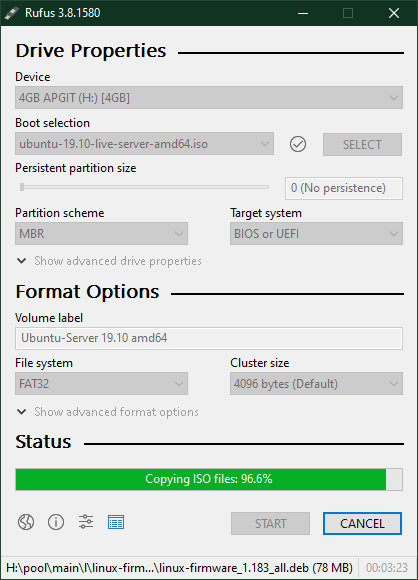

# Ubuntu Home Server

_Last Updated_: **2019-12-07**

## Hardware and Installation

### Hardware

- Consider purchasing a tower built for server usage (such as an Intel NUC or Synology)
- Can use old PC, such as Dell Optiplex 3020m in meantime
- Prefer SSD or newer NVMe PCIe Drive
- Connection via ethernet required
- Consider using a [UPS](https://en.wikipedia.org/wiki/Uninterruptible_power_supply)
- Consider usage for hardware needs (FTP, video streaming, webdev, etc)
- Recommended minimum specs: recent processor, 4GB RAM, 32GB SSD boot disk
- Keep server in a cool, clean place

### Download Ubuntu Server

- [Download Ubuntu Server 19.10](https://ubuntu.com/download/server)

### Create Installation Media

#### Create Installer on Windows

1. Download and run [Rufus](https://rufus.ie/)
2. Select a 2GB+ USB for the device, use downloaded Windoze ISO for Boot selection, and press start to create the bootable installer.
   1. ISO vs DD mode?
3. Put bootable USB installer in computer and boot into it

#### Create Installer on macOS

**Note**: This method has not been tested yet!

1. Convert the image to UDRW format with `hdiutil convert -format UDRW ubuntu-19.10-live-server-amd64.iso -o ubuntu.dmg`
2. Use DD to create installer with `sudo dd if=ubuntu.dmg of=/dev/rdisk1 bs=1m`
   1. Unmount target disk first and take note of name
   2. if = input file
   3. of = output file
   4. bs = block size (1m should speed up creation a little)

#### Create Installer on Linux

**Note**: This method has not been tested yet!

1. Use DD command: `sudo dd if=ubuntu-19.10-live-server-amd64.iso of=/dev/sdb1 bs=4M`
   1. Use `df -h` to find target drive
   2. Mount target drive first with `sudo umount /dev/sdb1`
   3. bs = block size (4M should speed up creation a little)

### Install Ubuntu Server

Insert installation into target machine and boot from USB to get started.

1. Choose Language
2. Select Keyboard Config
3. Configure Network
   1. Select ethernet instead of wifi!
4. Proxy Config (if needed)
5. Choose Ubuntu Archive Mirror
6. Use entire disk and setup LVM (for now)
   1. LVM allows storage expansion later without reinstall
7. Setup profile (name, server name, user/pass)
   1. Use a system for this, and record it somewhere safe!
8. Install OpenSSH server
    Choose featured server snaps
9.  Continue installation and wait for it to complete

Now it's safe to reboot, remove the installation media, and login with the credentials entered during installation!

## Next Video

[Configure the network for your server](https://www.lynda.com/Linux-tutorials/Configure-network-your-server/585253/611317-4.html)

---

## Reference Images

---

## Further Reading

- [How to verify your Ubuntu download](https://tutorials.ubuntu.com/tutorial/tutorial-how-to-verify-ubuntu)

---

## TODO

- Make a checklist for building ideal home server setup
- Take note of router configuration settings, add to documentation
